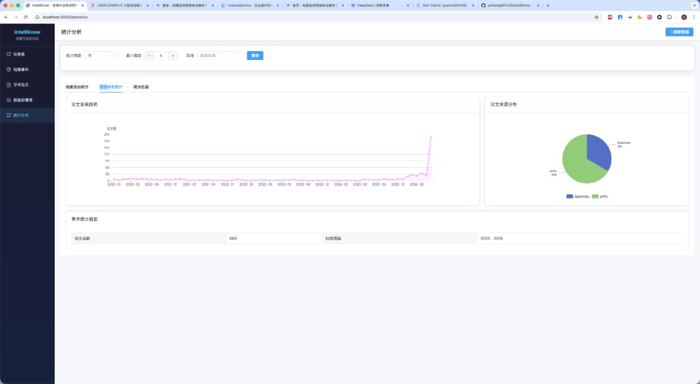
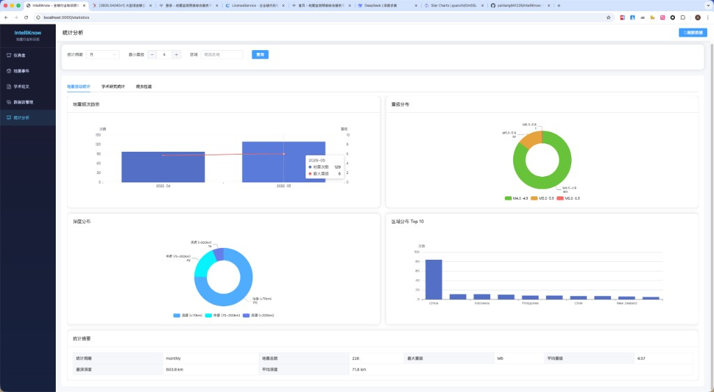
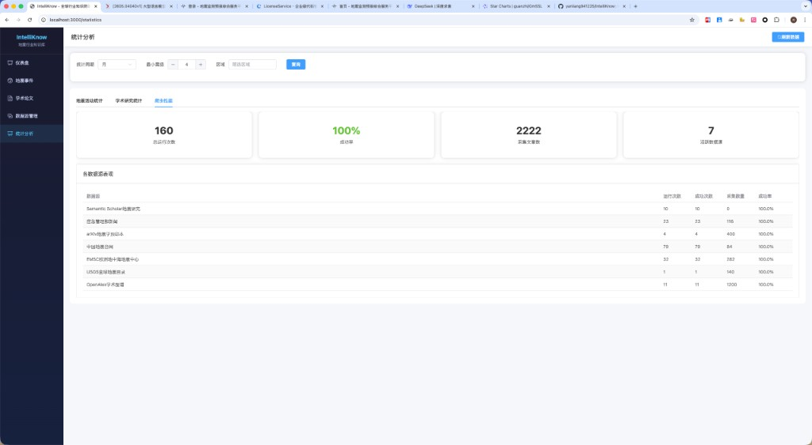
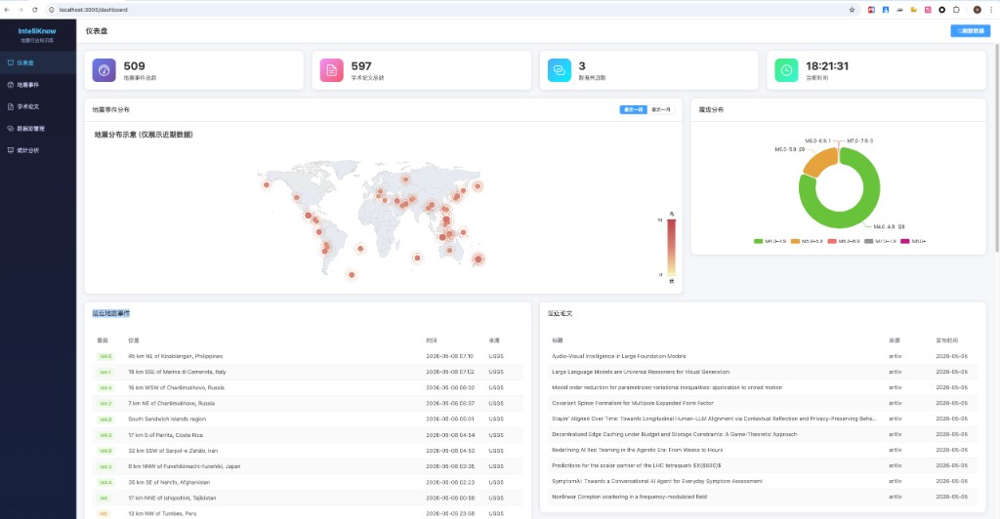

# IntelliKnow

> 全球行业研究知识爬取与智能分析系统

[](https://opensource.org/licenses/MIT)
[](https://www.python.org/)
[](https://vuejs.org/)

一个面向地震行业的多源数据智能采集与分析平台，自动爬取地震监测数据、学术论文、行业资讯，提供统计分析洞察和可视化仪表盘。

## 系统截图

### 仪表盘概览


### 地震事件追踪


### 学术论文搜索


### 数据源管理


## 功能特性

### 1. 多源数据采集

| 类型 | 数据源 | 说明 |
|------|--------|------|
| 地震监测 | USGS、中国地震台网、EMSC | 实时地震目录 |
| 学术论文 | arXiv、OpenAlex | 预印本与论文检索 |
| 行业资讯 | 应急管理部 | 政府公告与新闻 |
| 市场报告 | GM Insights、Gartner | 行业分析报告 |

### 2. 智能去重系统

- **SimHash 算法**：快速检测重复内容
- **双重校验**：标题+来源精确匹配 + 内容指纹
- **可配置阈值**：相似度阈值可调整（默认 0.85）

### 3. 数据分析仪表盘

- **地震活动监控**：全球地震分布热力图、震级/深度分析
- **学术研究统计**：论文趋势、来源分布、研究热点
- **实时事件列表**：最新地震事件追踪

### 4. 灵活的爬虫管理

- 可视化数据源配置
- 定时任务调度
- 动态启用/禁用爬虫

## 技术栈

**后端**
- Python 3.9+ / FastAPI
- SQLAlchemy ORM
- MySQL 数据库
- APScheduler 任务调度

**前端**
- Vue 3 + Composition API
- Vite 构建工具
- ECharts 数据可视化
- Element Plus UI 组件

**架构**
```
┌─────────────┐     ┌─────────────┐     ┌─────────────┐
│   Frontend   │────▶│   FastAPI   │────▶│    MySQL    │
│   Vue 3      │◀────│   Backend   │◀────│   Database  │
└─────────────┘     └──────┬──────┘     └─────────────┘
                           │
                    ┌──────▼──────┐
                    │  Scheduler  │
                    │  Crawlers   │
                    └─────────────┘
```

## 快速开始

### 环境要求

- Python 3.9+
- Node.js 18+
- MySQL 8.0+

### 1. 克隆项目

```bash
git clone https://github.com/yourusername/IntelliKnow.git
cd IntelliKnow
```

### 2. 配置数据库

```bash
cd backend
cp .env.example .env
```

编辑 `.env` 文件：

```env
DB_HOST=localhost
DB_PORT=3306
DB_USER=your_user
DB_PASSWORD=your_password
DB_NAME=intelliknow
```

### 3. 创建数据库

```sql
CREATE DATABASE intelliknow CHARACTER SET utf8mb4 COLLATE utf8mb4_unicode_ci;
```

### 4. 启动后端

```bash
cd backend
pip install -r requirements.txt
python -m core.init_db
uvicorn main:app --reload --host 0.0.0.0 --port 8000
```

### 5. 启动前端

```bash
cd frontend
npm install
npm run dev
```

访问 http://localhost:3000

## 项目结构

```
IntelliKnow/
├── backend/
│   ├── apps/
│   │   ├── crawlers/           # 爬虫模块
│   │   │   ├── spiders/       # 各类爬虫实现
│   │   │   ├── base.py         # 爬虫基类
│   │   │   └── scheduler.py    # 任务调度
│   │   ├── articles/           # 文章管理
│   │   ├── statistics/         # 统计分析
│   │   └── industries/         # 行业配置
│   ├── core/
│   │   ├── models.py          # 数据模型
│   │   ├── database.py        # 数据库连接
│   │   └── config.py          # 配置管理
│   └── main.py                # 应用入口
│
├── frontend/
│   ├── src/
│   │   ├── views/             # 页面组件
│   │   │   ├── Dashboard.vue  # 仪表盘
│   │   │   ├── Statistics.vue # 统计分析
│   │   │   └── DataSources.vue
│   │   ├── api/               # API 调用
│   │   └── router/            # 路由配置
│   └── package.json
│
├── docs/                       # 文档
├── README.md
└── LICENSE
```

## API 文档

启动服务后访问：
- Swagger UI: http://localhost:8000/docs
- ReDoc: http://localhost:8000/redoc

### 主要端点

| 模块 | 方法 | 端点 | 说明 |
|------|------|------|------|
| 统计 | GET | `/api/v1/statistics/overview` | 系统概览 |
| 统计 | GET | `/api/v1/statistics/earthquake` | 地震活动统计 |
| 统计 | GET | `/api/v1/statistics/academic` | 学术研究统计 |
| 地震 | GET | `/api/v1/earthquakes` | 地震事件列表 |
| 文章 | GET | `/api/v1/articles` | 文章列表 |
| 数据源 | GET | `/api/v1/datasources` | 数据源列表 |
| 数据源 | POST | `/api/v1/datasources/{id}/crawl` | 触发爬取 |

## 扩展开发

### 添加新数据源

1. 创建爬虫类：

```python
# backend/apps/crawlers/spiders/my_spider.py
from .base import BaseSpider

class MySpider(BaseSpider):
    name = "my_spider"
    source_type = SourceType.ACADEMIC

    def parse(self, response):
        # 解析逻辑
        yield {
            "title": "...",
            "content": "...",
            "url": "..."
        }
```

2. 注册爬虫：

```python
# backend/apps/crawlers/registry.py
from .spiders.my_spider import MySpider

CRAWLER_REGISTRY = {
    "my_spider": MySpider,
    # ...
}
```

3. 在数据库添加数据源记录后重启服务

## 配置说明

### 爬虫调度

编辑 `backend/core/config.py` 或环境变量：

```python
CRAWL_INTERVALS = {
    "earthquake_usgs": 3600,      # USGS 每小时更新
    "earthquake_ceic": 1800,      # 中国地震台网 30分钟
    "academic_arxiv": 86400,       # arXiv 每天
}
```

### 去重阈值

```python
# SimHash 相似度阈值 (0.0 - 1.0)
DUPLICATE_THRESHOLD = 0.85
```

## 数据说明

### 地震事件

| 字段 | 类型 | 说明 |
|------|------|------|
| event_id | string | 外部事件ID |
| magnitude | float | 震级 |
| latitude | float | 纬度 |
| longitude | float | 经度 |
| depth | float | 深度(km) |
| location | string | 位置描述 |
| time | datetime | 发震时刻 |
| source | string | 数据来源 |

### 学术论文

| 字段 | 类型 | 说明 |
|------|------|------|
| title | string | 论文标题 |
| content | text | 论文内容 |
| summary | text | 摘要 |
| url | string | 原文链接 |
| source | string | 来源平台 |
| author | string | 作者 |
| published_at | datetime | 发布时间 |

## License

本项目基于 [MIT License](LICENSE) 开源。

## 贡献指南

欢迎提交 Issue 和 Pull Request！

1. Fork 本仓库
2. 创建特性分支 (`git checkout -b feature/AmazingFeature`)
3. 提交更改 (`git commit -m 'Add some AmazingFeature'`)
4. 推送到分支 (`git push origin feature/AmazingFeature`)
5. 创建 Pull Request

## 联系方式

- 项目主页：https://github.com/yourusername/IntelliKnow
- 问题反馈：https://github.com/yourusername/IntelliKnow/issues
